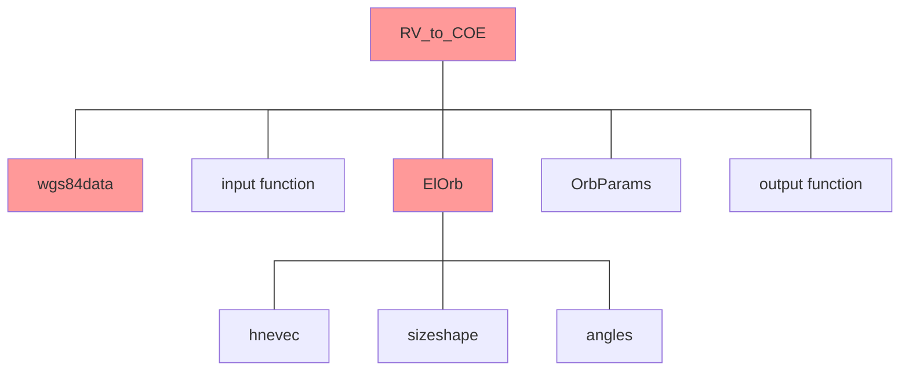
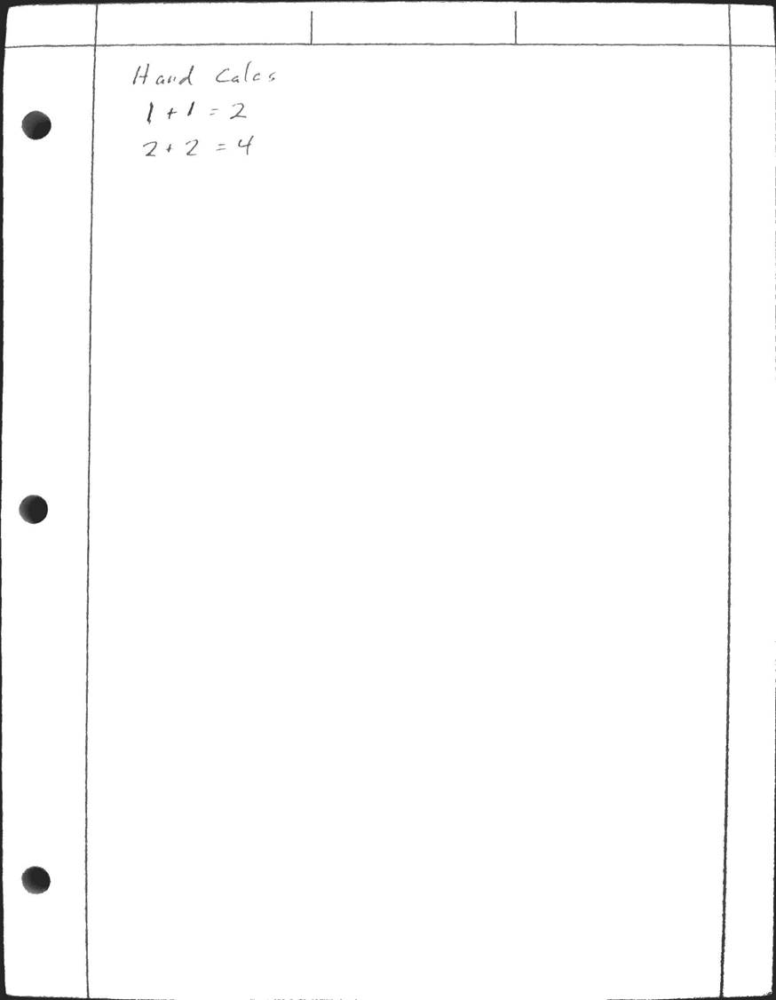

# A201 Project—RV to COE


## grading checklist 

- [ ] project complete

All of the following are required in order to receive credit for completion. Your instructor will check off your completed sections and provide comments below or on the files you submit. Copy your work below this cover checklist.

- [ ] algorithms: 1 for the main script; 1 for each sub-function
  Could someone duplicate your program from this?
- [ ] clear, concise, documented m-file code
- [ ] correct answers for provided test cases in `RV1.dat`
  - [ ] Create a table of expected vs actual
  - [ ] supporting hand calculations 
  - [ ] include the output file in your repository
- [ ] additional test cases and comparison table
  Explain why you needed extra test cases or why you didn’t. 


## authorized resources

 your instructor, your course notes, course materials and other cadets (but do not copy any of another cadet’s work)


## objective

The objective for Project RV to COEs is to write a MATLAB script file that determines the classic orbital elements of an Earth-orbiting body given its position and velocity vectors via a function called `ElOrb`. It also will determine other orbital parameters, including: radius at perigee, radius at apogee, energy and period. The scripts will then output all computed values to a file for later printing.

 

## requirements 

The function `ElOrb.m` will be added to your developing library for use in AstroEngr 321 and other advanced astrodynamics courses. As such, it should make use of utility functions `mag` and `vecangle` you have developed in class. It should also use the wgs84 data provided in the function `wgs84data`. You must document your code in accordance with the Astro Department’s standards.


## program specifications

The following is a description of the inputs to your program and the information your program must generate:

 

GIVEN:

- **I, J, K** components of the position vector $\vec{R}$ (km)

- **I, J, K** components of the velocity vector $\vec{V}$ (km/s)

 

FIND:

- Semimajor axis, $a$ (km)

- Eccentricity, $e$ (unitless)

- Inclination, $i$ (deg)

- Right Ascension of the Ascending Node, $\Omega$ (deg)

- Argument of Perigee, $\omega$ (deg)

- True Anomaly, $\nu$ (deg)

Plus other items listed later in the output format.


## code organization

Your program should be modular in construction. A suggested organization is depicted below. Red items are required.




## additional requirements

All subprograms listed above must be coded in MatLab.  

You will code all vectors as “column vectors,” a matrix with 3 rows and 1 column. 

You must use constants from wgs84data.m (see information in following section)

You can only use the wgs84 structure variable to pass wgs84data constants to functions

Your program must read inputs from the file `RV1.dat`. Units are km and km/s. The format for each line is:

```       
R(1), R(2), R(3), V(1), V(2), V(3)
```

Each R, V pair must be processed and printed to the output file before reading the next R, V pair

**Do not** hard-code the number of cases or the data into the program (use a while loop)

Your program must create a file and generate the following format. (Case 2 will follow immediately after this with the same format.)

```
***************** Case    1 *****************

R (km)    =  8840.0000 I     646.0000 J    5455.0000 K    Mag =  10407.6866
V (km/s)  =    -0.6950 I       5.2500 J      -1.6500 K    Mag =      5.5469

Radius of Perigee (km) =   6260.5311
Radius of Apogee  (km) =  11134.4744
Energy    (km^2/sec^2) =    -22.9147
Period           (sec) =   8072.4025
Period          (hour) =      2.2423
Semimajor Axis    (km) =   8697.5027
Eccentricity           =      0.2802

Inclination                           (deg) =     33.9987
Right Ascension of the Ascending Node (deg) =    250.0287
Argument of Perigee                   (deg) =    255.5372
True Anomaly                          (deg) =    214.8548
```


## hints

Intrinsic (Built-in) functions that you may find helpful are: `dot` and `cross`.

You can use the numbers above to validate case 1 but you will need to generate your own values to validate any other required cases.


## test case results

Provide test case results for Case 1—the results from the first line of `RV1.dat`. Compare program outputs to the expected outputs provided above and in `expected_outputs.txt`.

You have two options for this comparison. 

1. You can manually complete the table below. 
2. You can compare `expected_output.txt` to your output. If your output filename is `output.txt` you can compare files with this command line entry. 
   `git diff --no-index --word-diff expected_output.txt output.txt`

`git diff` will display the differences between the files. If there are no differences it will display nothing. 

If you select option 2, replace the table with the results of `git diff`. If files are identical, say so. 


You must still provide hand calculations. 


You must still provide any necessary additional test case results and discuss why they are or are not necessary. 

### case 1

**Input**: 

` put input here (1st line of RV1.dat)`

**Output**:

|               | expected | actual | units     |
| ------------- | -------- | ------ | --------- |
| $r_p$         |          |        |           |
| $r_a$         |          |        |           |
| $\varepsilon$ |          |        |           |
| $\mathbb{P}$  |          |        |           |
| $a$           |          |        |           |
| $e$           |          |        |           |
| $i$           |          |        | $\degree$ |
| $\Omega$      |          |        | $\degree$ |
| $\omega$      |          |        | $\degree$ |
| $\nu$         |          |        | $\degree$ |


## hand calculations

(crop appropriately)




## additional test cases

Explain why you did or did not need additional test cases. If necessary, include a table of results. 


## function information


### wgs84data

The Astro department has collected all of the key constants from the World Geodetic Survey of 1984 (WGS84) into a single function for use in the various astrodynamics programs in our courses. This is done to ensure consistency of these constants throughout. subsequent MatLab script files and functions. These variables are case-specific and must be referenced as such. The function must be called once from a main program script or function by simply coding the line

`wgs84 = wgs84data;`

The most appropriate place to code this line is in the driver program for each project. 

Any function requiring wgs84 constants would have the wgs84 variable passed in to the function and then it could use code such as:

`MU = wgs84.MU; %extract MU from wgs84`

`RE = wgs84.RE; %extract RE from wgs84`


### required functions

The following functions MUST be written and used in the appropriate places. The names of the input or output variables may be adapted to fit your needs. (Note: vectors are in all caps and scalars are all lowercase)

- mag
- vecangle
- ElOrb

#### mag

`function [B]= mag(A)`

 #### vecangle

`function [theta]= vecangle(A, B)`

#### ElOrb

`function [a,ecc,incl,raan,argp,nu]= ElOrb(R,V,wgs84)`

This function determines an object’s six classical orbital elements from its position and velocity vectors.

##### input

- **R** -- position                          vector in km
- **V** -- velocity                          vector in km/s
- **wgs84** – structure with constants          (various units)

 ##### output

- **a** – semimajor axis                     scalar in km
- **ecc** – eccentricity                      scalar (unitless)
- **incl** -- inclination                      scalar in radians
- **raan** -- right ascension of ascending node   scalar in radians
- **argp** -- argument of perigee              scalar in radians
- **nu** -- true anomaly                     scalar in radians

 

**NOTE: ElOrb MUST have exactly these inputs and outputs (no more/no less) and the angle units must be in radians!**


### optional functions

The following functions may be useful within function ElOrb in order to organize the code. Use of this structure is optional, but encouraged.

- hnevec
- sizeshape
- angles
- OrbParams

#### hnevec

`function [H,N,E] = hnevec(R,V,wgs84);`

This procedure determines the angular momentum, ascending node, and eccentricity vectors given the position and velocity vectors.

##### input

- **R** -- position                          vector in km
- **V** -- velocity                          vector in km/s
- **wgs84** – structure with constants          (various units)

##### output

- **H** -- specific angular momentum          vector in km2 /s
- **N** -- ascending node                    vector in km2 /s
- **E** -- eccentricity vector                  vector (unitless)

 

#### sizeshape

`function [a,ecc]=sizeshape(R,V,E,wgs84)`

This procedure determines the orbital parameters associated with size and shape of an orbit.

##### input

- **R** – position vector                     vector in km
- **V** – velocity vector                     vector in km/s
- **E** – eccentricity vector                  vector (unitless)
- **wgs84** – structure with constants          (various units)

##### output

- **a** – semimajor axis                     scalar in km
- **ecc** – eccentricity                      scalar (unitless)


#### angles

`function [incl,raan,argp,nu]=angles(R,V,H,N,E)`

This procedure determines all angular orbital elements. ***Be sure to perform quadrant checks.\***

 ##### input

- **R** – position vector                     vector in km
- **V** -- velocity vector                    vector in km/s
- **H** -- specific angular momentum vector    vector in km2/s
- **N** -- ascending node vector               vector in km2/s
- **E** -- eccentricity vector                  vector (unitless)

 ##### output

- **incl** -- inclination                      scalar in radians
- **raan** -- right ascension of ascending node   scalar in radians
- **argp** -- argument of perigee              scalar in radians
- **nu** -- true anomaly                     scalar in radians


#### OrbParams

`function [rp,ra,sme,period]=OrbParams(a,ecc,wgs84)`

This procedure determines some non-COE parameters of the orbit.

##### input 

- **a** – semimajor axis                     scalar in km
- **ecc** – eccentricity                      scalar (unitless)
- **wgs84** – structure with constants          (various units)

##### output

- **rp** – radius of perigee                   scalar in km
- **ra** – radius of apogee                   scalar in km2/s2
- **sme** – specific mechanical energy         scalar km
- **period** – period                        scalar (sec)

   

#### additional functions

Additionally, specialized functions to perform both input and output are optional, but encouraged.

 
