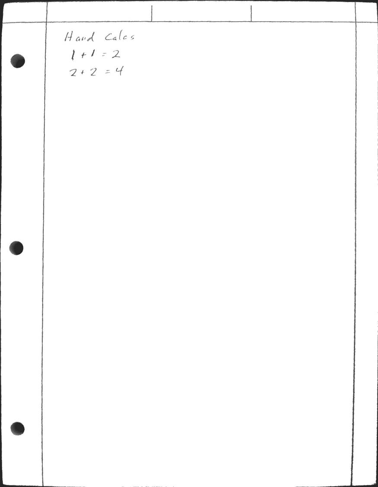

# A201 Project—COE to RV

## grading checklist

- [ ] project complete

All of the following are required in order to receive credit for completion. Your instructor will check off your completed sections and provide comments below or on the files you submit. Copy your work below this cover checklist.

- [ ] algorithms: 1 for the main script; 1 for each sub-function
  Could someone duplicate your program from this?
- [ ] clear, concise, documented m-file code
- [ ] correct answers for provided test cases in `RV2.dat`
  Cases 3 & 4 will need to be modified in `RV2dat`to include 1 orbit TOF as in the previous project.
  - [ ] Cases 1–4: Create a table of expected vs actual values for $\vec{R}_{ijk}$ and $\vec{V}_{ijk}$
  - [ ] Case 5: Create a table of expected vs actual values for $\vec{R}_{pqw}$, $\vec{V}_{pqw}$, $\vec{R}_{ijk}$, and $\vec{V}_{ijk}$
  - [ ] supporting hand calculations for case 5
  - [ ] include the output file in your repository
- [ ] additional sufficient test cases and comparison table
  - [ ] need at least a rotation test about the 2nd axis to ensure it works, because it isn’t used by the main project
  - [ ] Explain why you needed extra test cases or why you didn’t. 
    Remember to test all cases of `coeupdate.m`

## authorized resources

 your instructor, your course notes, course materials and other cadets (but do not copy any of another cadet’s work)

## objective

The objective for Project COEs to RV is to write a MATLAB script file that first determines the classic orbital elements of an Earth orbiting body given its current R and V vectors and the future classic orbital elements given a time of flight, as you did in Project COE Propagation, then determines the future R and V vectors via a function called RandV, and finally outputs results to a file for later printing.

## requirements

The function `RandV` will be added to your developing library for use in AstroEngr 321 and other advanced astrodynamics courses. As such, they should make use of utility you have developed in class. It should also use the wgs84 data provided in the function `wgs84data`. You must document your code in accordance with the Astro Department’s standards.

## program specifications

The following is a description of the inputs to your program and the information your program must generate:

GIVEN:

- initial **I, J, K** components of the position vector $\vec{R}$ (km)

- initial **I, J, K** components of the velocity vector $\vec{V}$ (km/s)

- time of flight **tof** (sec)

FIND:

- future **I, J, K** components of the position vector $\vec{R}$ (km)
- future **I, J, K** components of the velocity vector $\vec{V}$ (km/s)

## organization

Your program should be modular in construction. A suggested organization is depicted in the following outline. Items in red are required.


## additional requirements

All subprograms listed above must be coded in MatLab.  

You will code all vectors as “column vectors,” a matrix with 3 rows and 1 column. 

You must use constants from wgs84data.m 

You can only use the wgs84 structure variable to pass wgs84data constants to functions

Edit `RV2.dat` so that Cases 3 and 4 have the correct values for 1 orbit TOF. Your program must read inputs from the file `RV3.dat`. Units are km, km/s, s. The format for each line is:

```
R(1), R(2), R(3), V(1), V(2), V(3), TOF
```

Each R, V pair must be processed and printed to the output file before reading the next R, V pair

**Do not** hard-code the number of cases or the data into the program (use a while loop)

Your program must create a file and generate the following format. 

```
***************** Case    1 *****************

R (km)    =  8840.0000 I     646.0000 J    5455.0000 K    Mag=  10407.6866
V (km/s)  =    -0.6950 I       5.2500 J      -1.6500 K    Mag=      5.5469

Radius of Perigee (km) =   6260.5311
Radius of Apogee  (km) =  11134.4744
Energy    (km^2/sec^2) =    -22.9147
Period           (sec) =   8072.4025
Period          (hour) =      2.2423
Semimajor Axis    (km) =   8697.5027
Eccentricity           =      0.2802

Inclination                           (deg) =     33.9987
Right Ascension of the Ascending Node (deg) =    250.0287
Argument of Perigee                   (deg) =    255.5372
True Anomaly                          (deg) =    214.8548

Time of Flight  (Minutes) =      0.0000
Future True Anomaly (deg) =    214.8548

RPQW (km)  =  -8540.5836 P  -5947.9722 Q      0.0000 W  Mag =  10407.6866
VPQW (km/s)=      4.0303 P     -3.8111 Q      0.0000 W  Mag =      5.5469
RIJK (km)  =   8840.0000 I    646.0000 J   5455.0000 K  Mag =  10407.6866
VIJK (km/s)=     -0.6950 I      5.2500 J     -1.6500 K  Mag =      5.5469
```

## test case results

|     | expected | actual |
| --- | -------- | ------ |
|     |          |        |
|     |          |        |
|     |          |        |
|     |          |        |
|     |          |        |

## hand calculations

(crop appropriately)



## additional test cases

Explain why you did or did not need additional test cases. If necessary, include a table of results. 

## required function information

The following functions MUST be written and used in the appropriate places. The names of the input or output variables may be adapted to fit your needs. (Note: vectors are in all caps and scalars are all lowercase)

### RandV

```matlab
function [Rijk, Vijk, Rpqw, Vpqw] = RandV (af, eccf, inclf, raanf, argpf, nuf, wgs84)  
```

This procedure calculates position and velocity vectors in the Perifocal reference frame and then rotates the position and velocity vectors into the Geocentric-Equatorial reference frame

##### input

| variable   | description                | units      |
| ---------- | -------------------------- | ---------- |
| $a_f$      | future semimajor axis      | km         |
| $e_f$      | future eccentricity        | (unitless) |
| $i_f$      | future inclination         | rad        |
| $\Omega_f$ | future RAAN                | rad        |
| $\omega_f$ | future argument of perigee | rad        |
| $\nu_f$    | future true anomaly        | rad        |
| $wgs84$    | structure with constants   | (various)  |

##### output

| variable        | description                   | units |
| --------------- | ----------------------------- | ----- |
| $\vec{R}_{ijk}$ | future position vector in IJK | km    |
| $\vec{V}_{ijk}$ | future velocity vector in IJK | km/s  |
| $\vec{R}_{pqw}$ | future position vector in PQW | km    |
| $\vec{V}_{pqw}$ | future velocity vector in PQW | km/s  |

### axisrot

```matlab
function [B] = axisrot(A,axis,alpha)
```

This function performs a rotation of a vector `A` about the desired axis, `axis` by an angle, `alpha`.

#### input

| variable  | description                      |
| --------- | -------------------------------- |
| $\vec{A}$ | input: 3x1 column vector         |
| axis      | rotation axis: scalar 1, 2, or 3 |
| alpha     | rotation angle: rad              |

#### output

| variable  | description               |
| --------- | ------------------------- |
| $\vec{B}$ | output: 3x1 column vector |
