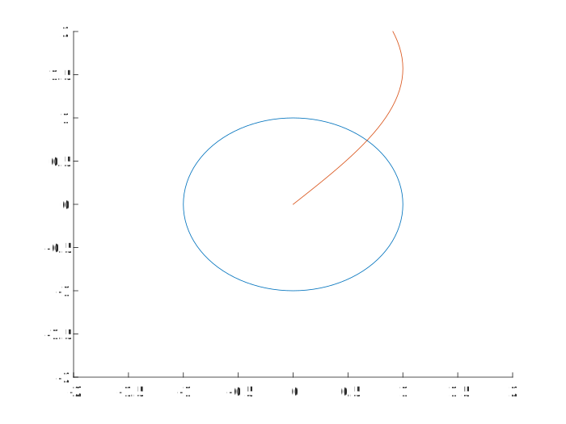

# A201 Exercise—plotting

## authorized resources

 your instructor, your course notes, course materials and other cadets (but do not copy any of another cadet’s work)


## background 

In this exercise you will practice some of the plotting commands. Try to accomplish as much as possible in a single script file.


## tasks

1. In Matlab, create the following variables by opening and running `create_data.m`. 
```matlab
t = 0:pi/50:10*pi
x = sin(t)
y = cos(t)
```
2) Clear workspace variables and load t, x, and y from the matlab data file `data.mat`. 
3) Plot x vs. y. Add a title and axis labels (whatever you want to call them.) Also, make both axes from -2 to 2.
4) In a second window make a 3-D plot of x, y, t.
5) In the first plot keep the original plot and plot on top of it, t vs. x. (i.e. t is on the horizontal axis)
6) Save both figures and insert them into your readme document. 


## submittal 

- [ ] code
- [ ] data file
- [ ] figure 1
- [ ] figure 2


## figures


### figure 1

Note: this example figure is incorrect in multiple ways. 



### figure 2

