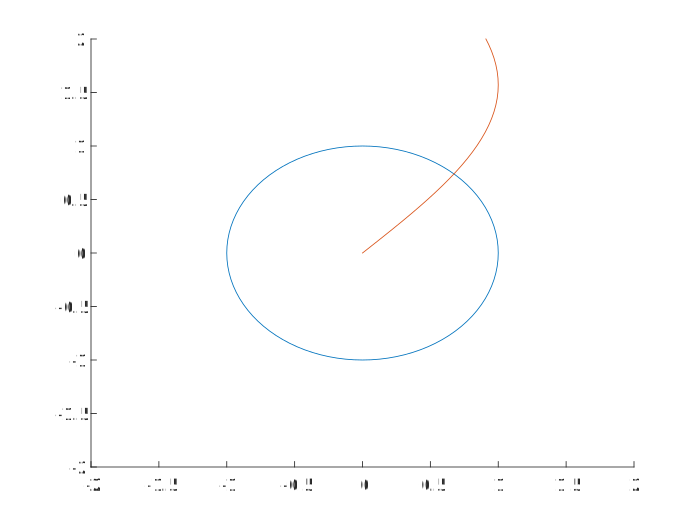

# 27 plotting

## documentation statement

## checklist

- [ ] modified `plot_data.m`
- [ ] data file
- [ ] figures—save image file (svg) to repository and insert here
  - [ ] figure 1
  - [ ] figure 2

## figures

### figure 1

Note: this example figure is incorrect in multiple ways. 

### figure 2
