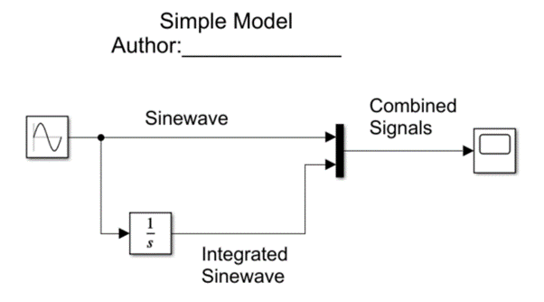

# A201 Exercise—simulink

## authorized resources

 your instructor, your course notes, course materials and other cadets (but do not copy any of another cadet’s work)

## background 

Simulink is a graphical programming language that makes developing models faster and easier for many problems. 

Your exercise is to create a simple Simulink model.

## tasks

Create the following model: 

You will need the following library blocks: Sine Wave, Integrator, MUX and Scope.

 

Run the program and view the output.

## submittal 

- [ ] simulink model `simple_model.slx` with documentation/annotations seen above
- [ ] cropped screenshot of your model
  - `win-shift-s`
  - place in `readme.md`
- [ ] plot
  - first file -> print to figure
  - then file -> save as -> svg
  - place in `readme.md`

## figures

use this syntax to add your image: ``
