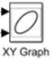

# A201 Exercise—numerical integration

## authorized resources

 your instructor, your course notes, course materials and other cadets (but do not copy any of another cadet’s work)

## background

Many integration problems are very difficult, if not impossible to solve analytically, so we often turn to numerical methods.  These often give us very accurate solutions by letting the computer crunch through many calculations.  

Your exercise is to recreate the Simulink model described in this lesson. 

## tasks

Build the following Simulink model and run it for a simulation time of 10 seconds.

Note: Newer versions of Matlab may have a different icon for the XY Graph:

​            

## hints

Position values (Rinit) are in km and velocity values (Vinit) are in km/s

For the integration block, double click on the block and change the “Initial Condition Source” to “external.”

Within the gravity model (accel.m), the horizontal acceleration is zero, and the vertical acceleration is:
$$
a_y = \frac{-\mu}{R^2}
$$
See the powerpoint slides for more details on this function. It is recommended that you cut and paste the code from the slides for accel.m (but finish the documentation).

Hint: The function `accel.m` calls `wgs84data`, which needs to be in matlab’s path. Before running your model, run this command to add the correct folder to your path for this session (until you restart matlab). 

​    `addpath ../projects/` 
​    (If you don’t, your plot will show a straight line.)

The model should produce the following plot.

## submittal

- [ ] simulink model `numerical_integration.slx`
- [ ] cropped screenshot of simulink model (save and add to `readme.md`)
- [ ] plot
  - export -> send snapshot to: matlab figure -> capture snapshot
  - file -> save as -> `*.svg`
  - add to `readme.md`

## figures

use this syntax to add your image: ``

### model output

### simulink model screenshot
